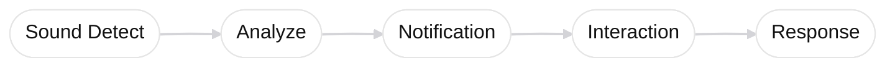
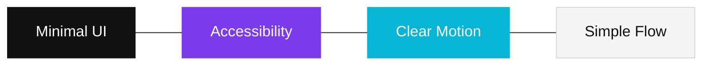
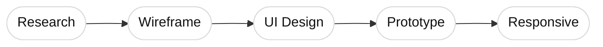

# GUIDEME 청각장애인 앱

- [노션에서 보기](https://cyber-grain-cff.notion.site/UX-UI-32cf732176aa8034b20ec8600e53a35e?source=copy_link)

<div align="center">

# 🔔 Guide Me

청각장애인을 위한  
실시간 소리 알림 서비스

<br>

UI/UX Design · Accessibility · Responsive Web

<br>


<br>

</div>

---

# ✨ Overview

```txt
소리를 듣기 어려운 사용자에게
위험 상황과 생활 소리를
실시간으로 전달하는 서비스
```

---

# 🧩 Core Features

<div align="center">

| 🔥 위험 감지 | 🚪 생활 알림 | 📱 실시간 알림 |
| ------------ | ------------ | -------------- |
| 화재         | 초인종       | 푸시 알림      |
| 경고음       | 전화         | 진동 인터랙션  |
| 사이렌       | 아기 울음    | 빠른 접근      |

</div>

---

# 🌊 User Flow



---

# 🎨 Design System

<div align="center">

| Primary | Secondary | Accent  |
| ------- | --------- | ------- |
| #111111 | #F5F5F5   | #7C3AED |

</div>

<br>



---

# 📱 Screens

<div align="center">

| Login        | Home         | Alert           |
| ------------ | ------------ | --------------- |
| UI Structure | Sound Status | Notification UX |

</div>

---

# 🛠 Workflow



---

# 📌 Keywords

<div align="center">

`Accessibility`
`Responsive`
`Motion UI`
`Sound Interaction`
`Inclusive Design`
`Real-time Notification`

</div>

---

# 📫 Contact

<div align="center">

<a href="https://github.com/leedonghwa0427">

</a>

<a href="https://cyber-grain-cff.notion.site/UX-UI-32cf732176aa8034b20ec8600e53a35e">

</a>

</div>
